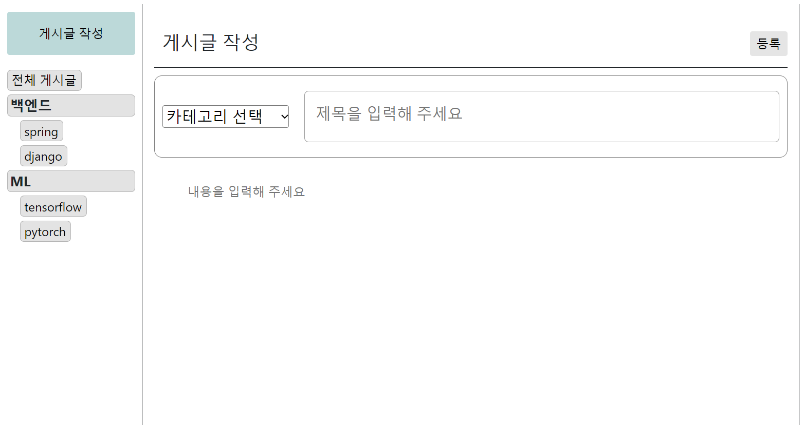

# 블로그 용 FrontEnd

### 개인 프로젝트

### 배포 URL (현재 종료)

#### https://lee-ht.github.io/codelia_react/

## 개발 환경

### VSCODE

### Node js 20.9.0

### React 18.2.0

## Posts CRD

#### 게시글의 기본적인 기능인 조회, 생성, 삭제 기능 구현

### 게시글 조회

### 게시글 생성

## Authentication

### 구글과 네이버 두개의 로그인 방식을 제공합니다.

### 로그인 후 session storage 에 accessToken, cookie 에 refreshToken 저장

#### accessToken 으로 유저 정보 요청 후 Context 에 저장

### 새로고침 또는 accessToken 만료 시 재 요청 로직 헤더에 작성

### 401 에러 시 토큰 재발급 후 재 요청

## Pagination

### 현재 페이지와 총 페이지를 인자로 받아 limit 만큼의 인접한 페이지 넘버 출력

### 버튼을 누르면 상위 컴포넌트의 현재 페이지 상태 변경

## Language

### i18next 을 이용한 다국어 처리

#### 헤더에 언어를 변경 할 수 있도록 메뉴 제공

#### 한글 메뉴

#### 영어 메뉴

### 구글 번역 API 를 이용한 게시글 내용 번역 기능

#### 번역 버튼을 이용해 자신의 게시글의 내용을 자신의 언어로 번역 가능

#### EX KR->EN

#### 번역 기능 사용 전

#### 번역 기능 사용 후

